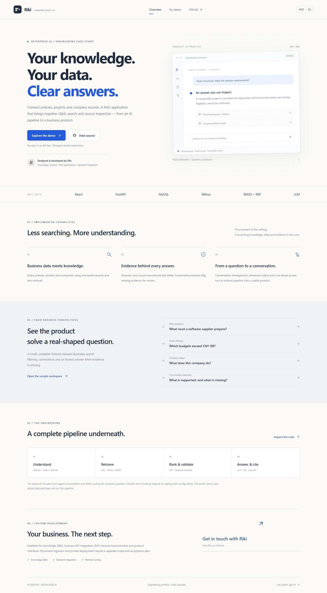
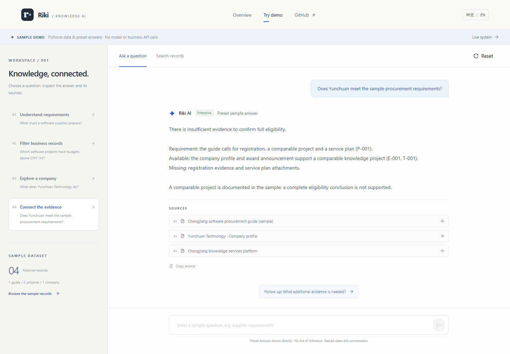
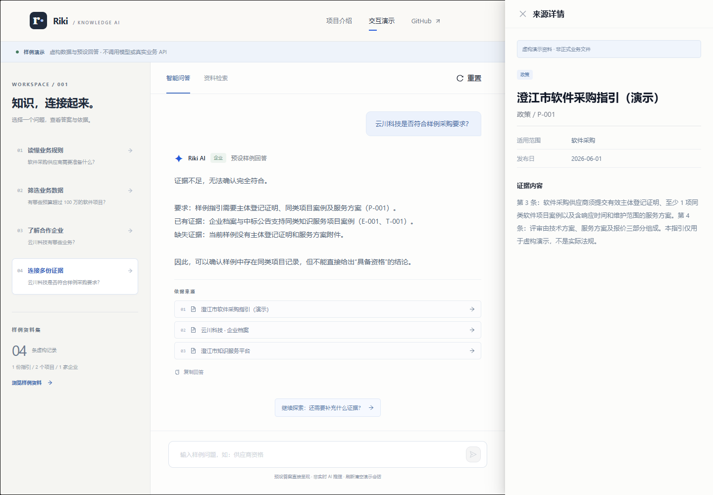
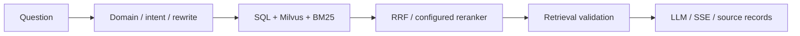

# Riki · Enterprise Knowledge Q&A

[Live showcase](https://riki2001-123.github.io/bidding-rag-qa-system/) · [Try the sample demo](https://riki2001-123.github.io/bidding-rag-qa-system/demo/) · [中文介绍](README.zh-CN.md) · [Source](https://github.com/Riki2001-123/bidding-rag-qa-system) · [Riki on GitHub](https://github.com/Riki2001-123)

**Connect business records and knowledge to answers with inspectable evidence.**

A portfolio case study of an enterprise AI application, using procurement as the example domain. Explore requirements, filter projects, look up companies and inspect the records behind an answer.



## Explore the product

The public demo runs entirely in the frontend: **no sign-in, backend or API key**. All companies, projects and guides are fictional. Answers and follow-ups are preset, not generated by an AI model.

The GitHub Pages site provides the showcase and samples. Its live-system routes explain how to arrange a separate integration; they do not expose sign-in or business APIs. The route table below describes the full local application. See the [Pages deployment specification](docs/pages-deployment-spec.md) for the published build boundaries.

| View | Route | What you can do |
|---|---|---|
| Showcase | `/` | Explore the case study, capabilities, architecture and custom development services |
| Sample workspace | `/demo` | Try four cases, ask preset follow-ups, search sample records and inspect sources |
| Live sign-in | `/login` | Sign in to a separately configured backend |
| Live application | `/chat`, `/search`, `/dashboard` | Use authenticated Q&A, business search and an architecture overview |

The interface defaults to Chinese and remembers the language switch. Sample questions, answers and evidence are bilingual. Live records and model answers remain in their original language.



### Four sample cases

- **Policy questions:** what does a supplier need to prepare?
- **Project filtering:** which software projects exceed a CNY 1M budget?
- **Company lookup:** what does the sample company do?
- **Cross-domain evidence:** what supports eligibility, and what is missing?

Click a case, choose its follow-up, then inspect a source. Search accepts Chinese or English keywords. Arbitrary questions do not produce invented answers: unmatched input prompts you to select a supported case. The demo conversation lives in memory and clears on reload; it does not read or modify live credentials or chat history.



## Implementation

React 18, Vite and Ant Design provide the bilingual product UI. The existing FastAPI backend uses MySQL business records, Milvus vector retrieval, BM25 keyword retrieval and SQL queries. RRF combines candidates; reranking and model selection depend on deployment configuration. Domain/intent routing, query rewriting, multi-agent orchestration and a ReAct path handle different question types. Answers carry source records and stream through SSE.



The frontend shares message, record and source-detail components across sample and live views. Public pages are loaded by route. Source details display only returned fields; authenticated attachment downloads use the existing backend permissions.

**Verification limits:** the showcase build and frontend contracts were checked locally. The [live integration evaluation](docs/live-system-evaluation.md) exercises MySQL, Milvus, embeddings, reranking and model streaming. A subsequent [policy answer quality evaluation](docs/answer-quality-evaluation.md) verifies original quotations, bounded format follow-ups and source restoration after restart. Policy answers use verified original excerpts; free-form summarization, other answer paths, current legal validity and production readiness are not certified. Existing local reports do not establish the former claims of 93% recall or a 35% → 15% hallucination reduction, so those claims are removed. No client outcomes or internship affiliation are claimed.

**Stream continuity:** the streaming endpoint now returns `session_id` in its final `done` event after successful persistence. Two-round API and browser conversations reuse that session. A failed model stream emits an error and preserves partial text in the UI without storing it as a completed answer.

## Run locally on Windows

Requirements: Node.js 18+ for the showcase; Python 3.10+, configured database, Milvus and model service for the live system. Use a project directory on **D:** on this machine.

Set runtime storage locations before installing dependencies:

```powershell
$projectPath = 'D:\python\PythonProject\RAG+LLMProject'
Set-Location $projectPath
New-Item -ItemType Directory -Force -Path dist/tmp, dist/cache/pip, dist/cache/huggingface | Out-Null
$env:TEMP = Join-Path $projectPath 'dist/tmp'
$env:TMP = $env:TEMP
$env:npm_config_cache = Join-Path $projectPath '.npm-cache'
$env:PIP_CACHE_DIR = Join-Path $projectPath 'dist/cache/pip'
$env:HF_HOME = Join-Path $projectPath 'dist/cache/huggingface'
```

### Showcase only

```powershell
Set-Location (Join-Path $projectPath 'frontend')
npm ci
npm run dev -- --host 127.0.0.1
```

Open [localhost:5173](http://127.0.0.1:5173). Both public routes work with the backend stopped. Live sign-in requires the backend; it never substitutes sample answers.

### Live system

From the project root, copy the template to **root `.env`**, which is the path read by backend configuration. Preserve an existing configuration.

```powershell
Set-Location $projectPath
if (-not (Test-Path .env)) { Copy-Item backend/.env.example .env }
python -m venv dist/backend-venv
./dist/backend-venv/Scripts/python.exe -m pip install -r backend/requirements.txt
# Configure root .env before starting:
./dist/backend-venv/Scripts/python.exe -m uvicorn app.main:app --app-dir backend --host 127.0.0.1 --port 8000
```

Configure `DATABASE_URL`, credentials, `SECRET_KEY`, LLM base URL/key/model, Milvus and `CORS_ORIGINS`. Keep attachments and model caches on D:. Match the embedding dimension to the selected model and existing index. Prepare business records and indexes before expecting useful live answers. Database initialization creates development users; manage these separately before exposing a live service.

For the current Windows machine, `./backend/scripts/start_local.ps1` starts a hidden backend with D: caches and logs, the existing offline model cache and local preview CORS. It uses `dist/backend-venv` if present, otherwise the existing D: Anaconda runtime. `RERANKER_BATCH_SIZE=4` bounds inference memory while keeping all candidates. The Milvus recovery configuration for this PC is in the ignored `dist/milvus-recovery/` directory; the [evaluation](docs/live-system-evaluation.md) describes startup and remaining limits. These paths are local-machine configuration, not cloud deployment settings.

The existing `docker-compose.milvus.yml` describes local Milvus services. It was not launched or modified in V1; use a configured instance and compatible persistent storage. After preparing the database and services, the existing index sync can be run from the project root:

```powershell
./dist/backend-venv/Scripts/python.exe -m backend.scripts.sync_mysql_index
```

The frontend defaults to `http://127.0.0.1:8000/api`. Configure `VITE_API_BASE_URL` in `frontend/.env.local` to connect another backend, then restart development or rebuild. Only public API location belongs in frontend configuration; model keys stay server-side.

## Build and host

```powershell
Set-Location (Join-Path $projectPath 'frontend')
npm run build
npm run preview -- --host 127.0.0.1 --port 4173
```

Output: **`dist/showcase/` at the project root**. Preview: [localhost:4173](http://127.0.0.1:4173). `vite preview` is a local review server; publish the generated files with a static hosting service.

Deploy at a domain root and configure SPA fallback: existing asset files are served normally; page routes such as `/demo` and `/login` rewrite to `index.html`. For example:

```nginx
location / {
    try_files $uri $uri/ /index.html;
}
```

If hosting the live API on the same domain, route `/api/` to the backend separately, before the SPA fallback. For a separate backend, set the public HTTPS API URL at build time and configure its CORS origins. Linux deployment uses explicitly mounted persistent paths, not Windows drive paths. Subdirectory hosting is outside this V1 configuration. No public deployment was performed.

## Validation and delivery

```powershell
Set-Location (Join-Path $projectPath 'frontend')
npm test
```

The browser suite uses Playwright and a locally installed Microsoft Edge by default. With Playwright available locally or through `PLAYWRIGHT_MODULE_DIR`, run `npm run test:browser` against the production preview. Set `SHOWCASE_TEST_URL` for a different preview URL and `SHOWCASE_BROWSER` to another installed browser channel. Direct all browser temp data to the D: `TEMP`/ `TMP` locations above.

Unit checks cover bilingual evidence consistency, strict question matching, record search and SSE byte framing. Browser checks cover public API isolation, source inspection, language persistence, mobile layout, protected routes and controlled live response/error/cancellation contracts. Controlled HTTP responses are **not live backend verification**.

- [V1 specification](docs/showcase-spec.md)
- [V1 evaluation and limitations](docs/showcase-evaluation.md)
- [Deployment and browser test instructions](docs/showcase-deployment.md)
- Test reports and temporary captures: `dist/showcase-tests/`
- Selected screenshots: `docs/images/`

## Work with Riki

Available for enterprise knowledge Q&A, business API integration, RAG retrieval improvements and product UI development. Document ingestion, private deployment and other additions require a separate scope and acceptance plan; they are not presented as completed V1 features.

[Visit Riki's GitHub profile](https://github.com/Riki2001-123) to learn more and get in touch.

This repository is a portfolio demonstration. No open-source usage license is granted here; contact the author about usage terms.
