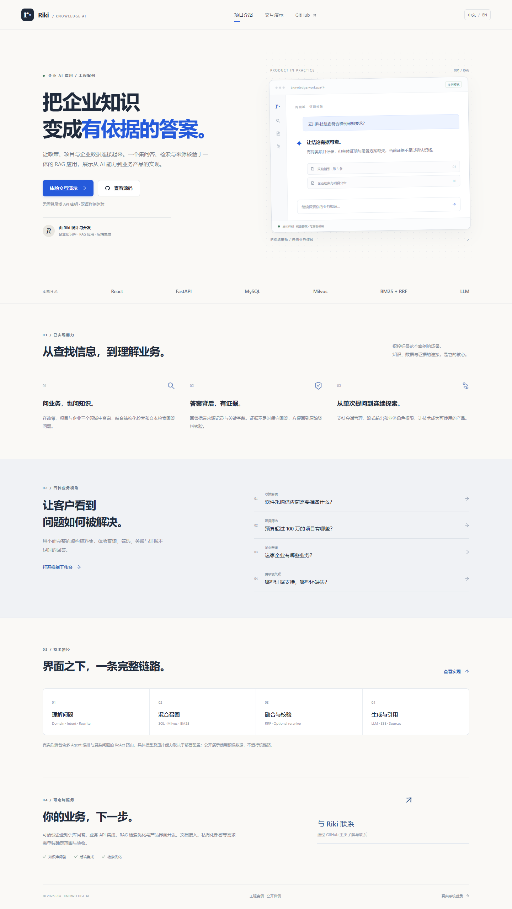
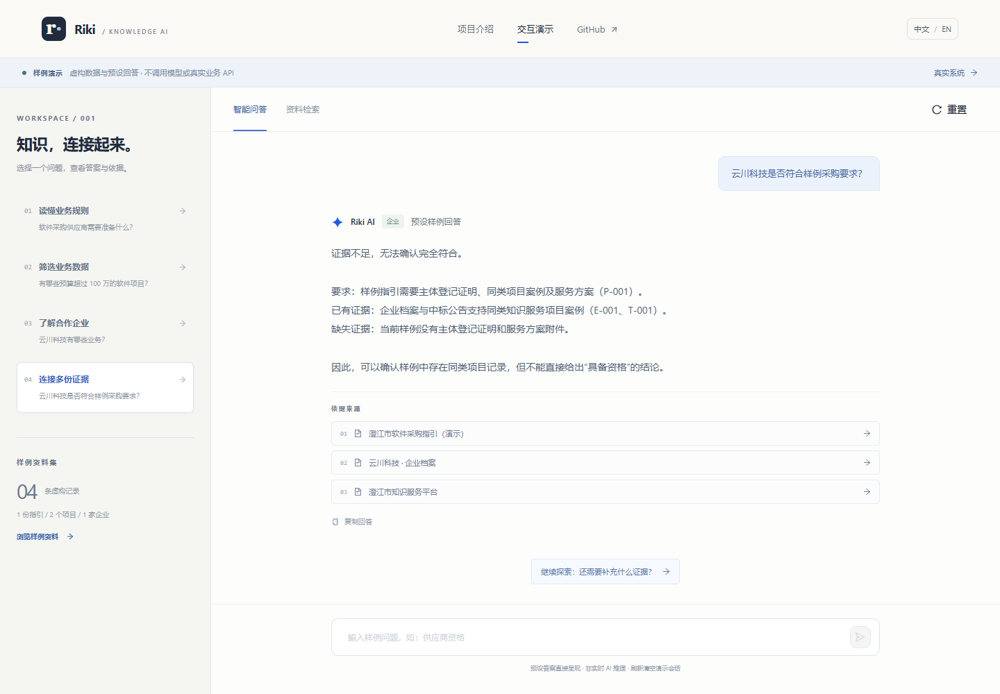

# Riki · 企业知识问答

[English](README.md) · [查看源码](https://github.com/Riki2001-123/bidding-rag-qa-system) · [联系 Riki](https://github.com/Riki2001-123)

**把企业知识与业务数据，变成有依据的答案。**

这是一个面向企业 AI 应用客户的工程案例，以招投标采购为业务场景，展示知识问答、项目筛选、企业查询与来源核验。



## 体验方式

公开演示完全运行在前端，**无需登录、后端或 API 密钥**。企业、项目和采购指引均为虚构；回答与追问预先编写，不是模型实时生成。

| 页面 | 路由 | 功能 |
|---|---|---|
| 展示首页 | `/` | 项目价值、能力、架构、源码与服务联系 |
| 样例工作台 | `/demo` | 四组问答与追问、样例搜索、领域筛选、来源详情 |
| 真实系统登录 | `/login` | 登录已配置的后端 |
| 真实业务系统 | `/chat`、`/search`、`/dashboard` | 鉴权问答、业务数据检索、架构总览 |

界面默认中文，可切换英文并记住选择。样例问题、回答和证据均为双语；真实业务数据与模型回答保持原文。



四个案例分别演示：供应商材料要求、预算超过 100 万的项目筛选、企业业务查询，以及企业与采购要求的证据关联。每组提供一个预设追问。点击来源可以查看关键字段与完整虚构片段。

自由输入只匹配样例问题与明确别名。未匹配的问题会引导选择案例，不编造新答案。演示会话仅在内存中保存，刷新重置；不会读取或修改真实系统的 token 和聊天历史。


## 实现能力与边界

前端使用 React 18、Vite 与 Ant Design。真实后端使用 FastAPI、MySQL、Milvus、BM25 和 SQL 检索，并包含领域/意图判断、问题改写、RRF 融合、可配置重排、多 Agent 编排与 ReAct 路由。回答通过 SSE 输出，并返回来源记录。

前端复用问答、检索记录与来源详情组件，按路由加载。真实来源只展示接口返回的字段；附件下载继续经过后端鉴权。公开演示不运行真实检索与模型链路。

展示构建与前端接口行为已验证；[真实联调记录](docs/live-system-evaluation.md)覆盖本机 MySQL、Milvus、Embedding、重排和模型流式调用。后续[政策问答质量验收](docs/answer-quality-evaluation.md)验证了原文引用、格式追问证据范围及重启恢复。**政策答复采用可核验原文摘录；自由语义概括、其他回答路径、法律时效及生产部署仍未全面验收。**现有本地评测不能支撑原 README 的“召回率 93%”和“幻觉率从 35% 降至 15%”口径，因此撤下。未使用未经确认的实习经历、客户背书或商业交付成果。

流式后端现在在保存成功后的 `done` 事件中回传 `session_id`，真实 API 和网页的两轮对话已验证复用同一会话。模型流式失败会返回错误；界面保留已有片段，不将未完成回答保存为成功回答。

## 本地启动：先体验展示

在此 Windows 电脑上，新数据放在 D 盘。Node.js 18+ 即可运行公开展示。

```powershell
$projectPath = 'D:\python\PythonProject\RAG+LLMProject'
Set-Location $projectPath
New-Item -ItemType Directory -Force -Path dist/tmp, dist/cache/pip, dist/cache/huggingface | Out-Null
$env:TEMP = Join-Path $projectPath 'dist/tmp'
$env:TMP = $env:TEMP
$env:npm_config_cache = Join-Path $projectPath '.npm-cache'
$env:PIP_CACHE_DIR = Join-Path $projectPath 'dist/cache/pip'
$env:HF_HOME = Join-Path $projectPath 'dist/cache/huggingface'
Set-Location (Join-Path $projectPath 'frontend')
npm ci
npm run dev -- --host 127.0.0.1
```

打开 [localhost:5173](http://127.0.0.1:5173)。首页和样例工作台在后端关闭时也能使用；真实登录入口需连接后端。

## 真实后端：单独配置

需要 Python 3.10+、数据库、Milvus、业务记录及模型服务。配置文件位于**项目根目录 `.env`**，保留已有配置：

```powershell
Set-Location $projectPath
if (-not (Test-Path .env)) { Copy-Item backend/.env.example .env }
python -m venv dist/backend-venv
./dist/backend-venv/Scripts/python.exe -m pip install -r backend/requirements.txt
# 编辑根目录 .env 后启动
./dist/backend-venv/Scripts/python.exe -m uvicorn app.main:app --app-dir backend --host 127.0.0.1 --port 8000
```

配置数据库连接、密钥、LLM API、Milvus 和 CORS；附件和模型缓存使用 D 盘路径。Embedding 维度必须与模型和现有索引一致。数据库初始化包含开发账号，公开真实服务前需单独管理。

当前 Windows 电脑可运行 `./backend/scripts/start_local.ps1`，在后台启动后端，显式配置 D 盘日志、缓存、本地离线模型及构建预览的 CORS。优先使用 `dist/backend-venv`，否则使用已有 D 盘 Anaconda。`RERANKER_BATCH_SIZE=4` 限制推理内存，不删减候选记录。本机 Milvus 恢复配置保存在已忽略的 `dist/milvus-recovery/`，启动方式及限制见[联调评估](docs/live-system-evaluation.md)。这些盘符和路径用于当前电脑，不直接用于云端。

现有 `docker-compose.milvus.yml` 未在本版运行或修改。请使用已配置的 Milvus 实例及兼容的持久化存储。准备好业务记录与服务后，从项目根目录执行既有索引同步：

```powershell
./dist/backend-venv/Scripts/python.exe -m backend.scripts.sync_mysql_index
```

前端默认连接 `http://127.0.0.1:8000/api`；其他地址通过 `frontend/.env.local` 中的 `VITE_API_BASE_URL` 配置，修改后重启开发服务或重新构建。模型密钥仅放后端。

## 构建、部署与验收

```powershell
Set-Location (Join-Path $projectPath 'frontend')
npm test
npm run build
npm run preview -- --host 127.0.0.1 --port 4173
```

构建输出在项目根目录 **`dist/showcase/`**。打开 [localhost:4173](http://127.0.0.1:4173) 查看生产构建。预览服务用于本地检查；正式托管使用生成的静态文件。

采用域名根目录部署，并将 `/demo` 等页面路由回退到 `index.html`；真实 `/api/` 路径需单独交给后端。Linux 持久化使用明确挂载路径，不直接使用 Windows 盘符。本版没有公网发布，不包含子目录托管配置。

浏览器测试使用 Playwright 与已安装的 Edge，针对生产预览执行 `npm run test:browser`；完整配置见部署说明。测试报告与临时截图位于 D 盘 `dist/showcase-tests/`。

- [V1 SPEC](docs/showcase-spec.md)
- [评估：通过、失败与未验证项](docs/showcase-evaluation.md)
- [部署和浏览器测试说明](docs/showcase-deployment.md)
- [手机演示截图](docs/images/mobile-demo-zh.png)

受控 HTTP 测试验证前端的登录、流式处理、错误、取消与检索行为，不能代替真实数据库或模型联调。

## 可洽谈的开发服务

企业知识库问答、业务 API 集成、RAG 检索优化、产品界面开发。文档接入、私有化部署等需求另定规格和验收，不描述为 V1 已交付能力。

通过 [Riki 的 GitHub 主页](https://github.com/Riki2001-123) 了解与联系。

本仓库用于作品展示，未授予开放使用许可；使用条款请联系作者。
