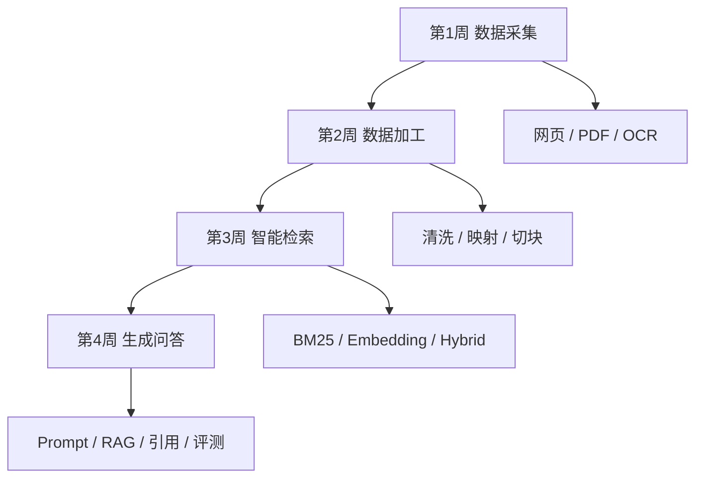

# 图中技能 4 周压缩掌握路线图

这份路线图对应你给的“政策 / 招标 / 企业智能问答系统建设步骤图”，目标不是只记住名词，而是把图里的能力逐步练到能在当前项目中解释、验证和维护。

默认节奏：

- 周期：4 周
- 时间：每天 2 小时，每周 6 天
- 学习方式：项目实战优先
- 主线仓库：当前 `FastAPI + React + Excel 导入 + 混合检索 + 问答` 系统
- 补充实验：网页采集、PDF/OCR、BM25、评测等当前仓库未完全实现的能力

## 技能总览

## 第 1 周：数据采集与原始资料理解

目标：
掌握图中“数据采集”阶段涉及的基础能力，并理解这些原始数据为什么最终会进入 Excel，再被当前系统导入。

### 要掌握的技能

- 网页采集基础：`requests`、HTML 结构、CSS 选择器、基本反爬认知
- 文档采集基础：PDF 文本提取、扫描件与 OCR 的区别
- 元信息保留：来源链接、发布时间、地区、业务域、原文件名、正文类型
- 数据入库前思维：为什么采集结果需要先结构化再入库

### 和当前项目的对应关系

- 当前系统不直接采网页，而是把“清洗后的结构化结果”作为 Excel 输入
- 你要理解的是“采集结果如何变成导入字段”，而不是只会点导入按钮
- 可以直接参考现成样例：
  - `sample_data/policy_sample.xlsx`
  - `sample_data/tender_sample.xlsx`
  - `sample_data/enterprise_sample.xlsx`

### 重点阅读

- `README.md`
- `docs/architecture.md`
- `backend/app/services/excel_import.py`

### 本周实操

1. 手工整理 1 份政策、1 份招标、1 份企业样例数据，字段尽量贴近系统模板
2. 选 1 个网页或 PDF，提取标题、正文、来源链接、发布时间，整理成 Excel 字段草稿
3. 对比原文和结构化字段，说明哪些信息适合做结构化检索，哪些适合做语义检索

### 本周通过标准

- 能解释 HTML、PDF、OCR 三类来源的差异
- 能说清“原始资料 -> 字段整理 -> Excel 导入”的转换关系
- 能自己整理出一份适合当前系统的字段表

## 第 2 周：数据加工与文本切块

目标：
掌握图中“数据加工”阶段的关键技能，看懂当前项目的数据标准化、字段映射、切块策略。

### 要掌握的技能

- `pandas` 基础清洗：空值、日期、金额、字符串标准化
- 正则抽取：项目名、地区、金额、统一社会信用代码
- 去重和标准化：同义列名、字段别名、统一格式
- 文本切块：按段落、句子、字段切分；理解 `max_chars` 和 `overlap`

### 和当前项目的对应关系

- 列名标准化和字段映射在 `DOMAIN_CONFIGS`
- 数据类型标准化在 `_normalize_date()`、`_normalize_amount()`、`_safe_text()`
- 递归切块在 `recursive_split_text()`
- 不是所有字段都进向量库，只有语义字段会切块并向量化

### 重点阅读

- `backend/app/services/excel_import.py`
- `backend/app/services/text_splitter.py`
- `backend/app/models/entities.py`

### 本周实操

1. 用 1 份模拟 Excel 做列名标准化和别名映射练习
2. 对同一段长文本分别做：
   - 整段不切
   - 按句切
   - 当前项目的递归切块
3. 画出导入流程图：模板下载 -> 上传 -> 校验 -> 入库 -> 切块 -> 向量化

### 本周通过标准

- 能解释 `DOMAIN_CONFIGS` 的职责
- 能说明为什么不是所有字段都做向量化
- 能说清当前切块策略适合什么场景，不适合什么场景

## 第 3 周：智能检索

目标：
掌握图中“智能检索”阶段的核心能力，吃透当前系统的结构化检索、向量检索、混合召回和权限过滤。

### 要掌握的技能

- BM25 / 关键词检索的基本思想
- Embedding 与向量相似度
- 向量库基础：Faiss、numpy 回退、索引文件
- Hybrid Search：结构化过滤 + 语义召回 + 合并排序
- 权限过滤：为什么“搜得到”不一定“看得到”

### 和当前项目的对应关系

- 结构化过滤在 `search_domain()`
- 语义召回在 `merge_with_semantic_hits()`
- 向量生成在 `EmbeddingService`
- 索引存储在 `VectorStore`
- 权限过滤会同时影响搜索结果和附件下载

### 重点阅读

- `backend/app/services/retrieval.py`
- `backend/app/services/embeddings.py`
- `backend/app/services/vector_store.py`

### 本周实操

1. 对比纯关键词检索和当前混合检索的结果差异
2. 观察 `storage/vector_store` 在导入前后的 `.json` 和 `.npy` 变化
3. 用 `admin`、`internal`、`supplier` 对同一关键词做检索并记录结果差异
4. 解释 `TextChunk` 与原始记录之间的关系

### 本周通过标准

- 能解释 BM25、Embedding、Hybrid Search 的差别
- 能说清结构化结果和语义命中是如何合并的
- 能解释权限过滤为什么影响搜索和附件

## 第 4 周：生成问答与评测

目标：
掌握图中“生成问答”阶段的技能，并能解释当前系统的 RAG 回答、引用机制和保守回答逻辑。

### 要掌握的技能

- Prompt 基础：系统提示词、证据约束、保守回答
- RAG 链路：问题 -> 检索 -> 证据拼接 -> 回答生成
- 引用与可追溯性：citation、附件关联、证据不足时的降级
- 评测基础：命中率、答案准确性、引用质量、幻觉控制

### 和当前项目的对应关系

- 问题分类和回答组织在 `backend/app/services/chat.py`
- 模型调用和 fallback 在 `backend/app/services/llm.py`
- 引用内容来自检索结果，不是前端临时拼出来的
- 未配置在线模型时系统仍能运行，因为有 fallback 回答策略

### 重点阅读

- `backend/app/services/chat.py`
- `backend/app/services/llm.py`
- `backend/tests/smoke_test.py`

### 本周实操

1. 针对“有证据”和“无证据”问题分别提问，比较回答差异
2. 梳理 `search` 与 `chat` 的职责边界
3. 完成 1 个小改动设计题：
   - 新增一个搜索筛选条件
   - 补一个 Excel 字段映射
   - 调整一个前端展示字段
4. 做一次 10 分钟系统讲解

### 本周通过标准

- 能说清 citation 是怎么来的
- 能解释为什么未配置在线模型时系统仍能回答
- 能独立讲出一条完整链路：登录 -> 导入 -> 检索 -> 问答 -> 引用

## 每天 2 小时建议模板

| 时间 | 动作 | 说明 |
| --- | --- | --- |
| 40 分钟 | 读源码或补基础 | 只看当前主题相关文件，避免分散 |
| 40 分钟 | 跑接口、页面或小实验 | 用真实现象验证理解 |
| 20 分钟 | 整理笔记 | 写下学会了什么、没搞懂什么 |
| 20 分钟 | 复述讲解 | 不看代码直接讲一遍 |

## 最终你应掌握的能力

- 能看懂图中的 4 个阶段及其先后关系
- 能把图中的技能映射到当前 RAG 项目
- 能独立跑通导入、检索、问答主链路
- 能解释为什么系统能回答、为什么有时答得保守
- 能继续往网页采集、OCR、BM25、评测体系方向扩展

## 配套资料

- [2 周掌握当前系统](./study-plan.md)
- [系统学习地图](./system-study-map.md)
- [联调与排错手册](./maintenance-lab.md)
- [技能学习产出模板](./skill-workbook.md)
