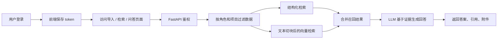

# 系统学习地图

这份文档帮助你把“看源码”变成“看懂源码”。建议在学习时把它和 `docs/study-plan.md` 一起打开。

## 1. 用一句话理解这个系统

这是一个以 Excel 为主数据源的 RAG 问答系统，支持三类业务域数据导入，在权限过滤后进行结构化检索和语义召回，再由 LLM 根据证据生成答案和引用。

## 2. 主链路

## 3. 从文件结构看系统

| 目录/文件 | 作用 | 学习时要回答的问题 |
| --- | --- | --- |
| `backend/app/main.py` | FastAPI 入口和启动初始化 | 应用启动时做了什么 |
| `backend/app/api/router.py` | 汇总所有路由 | 接口是按什么边界拆分的 |
| `backend/app/api/routers/*.py` | 各业务接口入口 | 每个接口收什么参数、返回什么数据 |
| `backend/app/models/entities.py` | SQLAlchemy 数据模型 | 哪些表支撑导入、检索、问答 |
| `backend/app/services/*.py` | 业务能力实现 | 真正的核心逻辑藏在哪些服务里 |
| `backend/tests/smoke_test.py` | 最小端到端验证 | 项目作者认为哪些流程必须可用 |
| `frontend/src/App.jsx` | 页面路由入口 | 前端有哪些主页面 |
| `frontend/src/pages/*.jsx` | 页面实现 | 每个页面使用了哪些接口 |
| `frontend/src/api/client.js` | 请求封装 | token 和错误处理在哪一层完成 |

## 4. 页面 -> API -> 服务 -> 数据表

| 页面 | 主要接口 | 主要服务/逻辑 | 主要数据表 |
| --- | --- | --- | --- |
| 登录页 `LoginPage.jsx` | `POST /api/auth/login`、`GET /api/auth/me` | `security.py`、`deps.py` | `users` |
| 导入页 `ImportPage.jsx` | `GET /api/imports/templates/{domain}`、`POST /api/imports/{domain}/excel` | `excel_import.py`、`text_splitter.py`、`embeddings.py`、`vector_store.py` | `import_jobs`、业务表、`text_chunks` |
| 搜索页 `SearchPage.jsx` | `GET /api/search/policy`、`/tender`、`/enterprise` | `retrieval.py` | 业务表、`attachments`、`text_chunks` |
| 问答页 `ChatPage.jsx` | `POST /api/chat/query`、`GET /api/chat/sessions/{id}` | `chat.py`、`retrieval.py`、`llm.py` | 业务表、`chat_sessions`、`chat_messages` |
| 附件能力 | `POST /api/attachments/upload`、`GET /api/attachments/{id}/download` | `attachments.py`、`retrieval.py` | `attachments` |

## 5. 三个业务域怎么区分

| 业务域 | 记录表 | 结构化重点字段 | 语义字段重点 | 默认适合提什么问题 |
| --- | --- | --- | --- | --- |
| `policy` | `policy_records` | 标题、发布日期、地区、适用范围 | 摘要、正文、适用范围 | 某政策是否适用、政策内容是什么 |
| `tender` | `tender_records` | 项目名、招标人、阶段、地区、中标金额 | 内容摘要、项目标题、项目名称 | 某项目招标情况、地区和阶段筛选 |
| `enterprise` | `enterprise_records` | 企业名称、统一社会信用代码、地区、行业 | 经营范围、备注、行业 | 企业信息核验、行业和业务范围检索 |

## 6. RAG 主干模块

| 模块 | 关键文件 | 你要学会说明的点 |
| --- | --- | --- |
| 导入 | `backend/app/services/excel_import.py` | 列名别名映射、必填校验、记录构建 |
| 切块 | `backend/app/services/text_splitter.py` | 为什么只切长文本字段，不切整行 |
| 向量化 | `backend/app/services/embeddings.py` | 有模型和无模型两种模式如何降级 |
| 向量库 | `backend/app/services/vector_store.py` | Faiss 与 numpy 回退逻辑 |
| 检索 | `backend/app/services/retrieval.py` | 结构化结果怎样和语义结果合并 |
| 回答 | `backend/app/services/chat.py`、`backend/app/services/llm.py` | 证据如何传给 LLM，citation 从哪来 |

## 7. 权限机制的最小理解

- `admin`：不过滤项目和访问级别。
- `internal`：只能看 `public/internal`，且必须在授权项目内或无项目归属。
- `supplier`：只能看 `public`，且必须在授权项目内或无项目归属。

你在学习时要重点追踪 `apply_permission_filters()`，因为它同时影响搜索结果和附件可见性。

## 8. 10 分钟讲解提纲

如果要向别人讲这套系统，可以按下面顺序讲：

1. 它解决什么问题：把 Excel 主数据变成可检索、可问答的知识系统。
2. 它的输入是什么：政策、招标、企业三类 Excel。
3. 它的核心处理链路：导入、校验、入库、切块、向量化、混合检索、LLM 回答。
4. 它如何控制数据可见性：角色 + 项目授权 + 访问级别。
5. 它的前端怎么用：登录、导入、搜索、问答。
6. 它还能怎么扩展：新增字段、新增筛选项、新增业务域、替换 embedding/LLM 能力。
